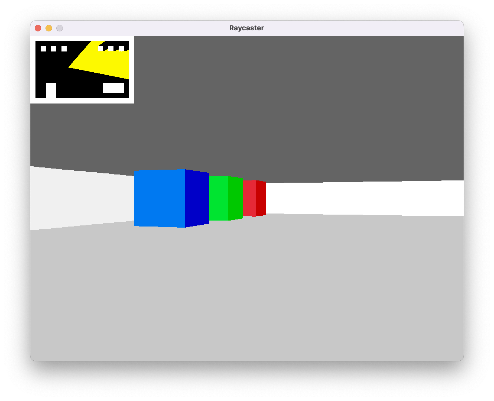

# raycasting-c

This game is an implementation of a raycasting game based on the [Raycasting Engine Programming](https://pikuma.com/courses/raycasting-engine-tutorial-algorithm-javascript) course by Pikuma.

It is written in C and uses `clang`, `clang-format`, [raylib](https://www.raylib.com/index.html) and `GNU make`.

